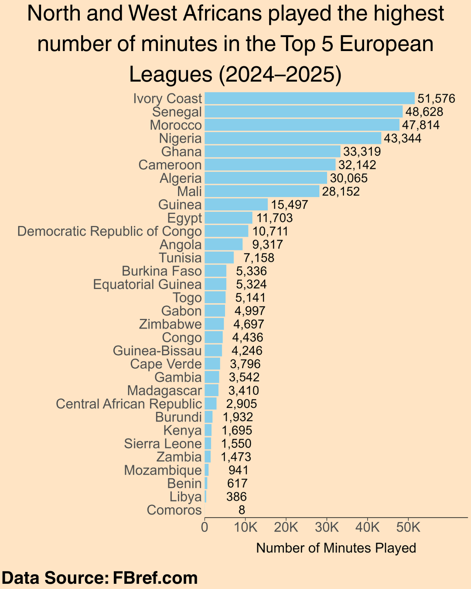
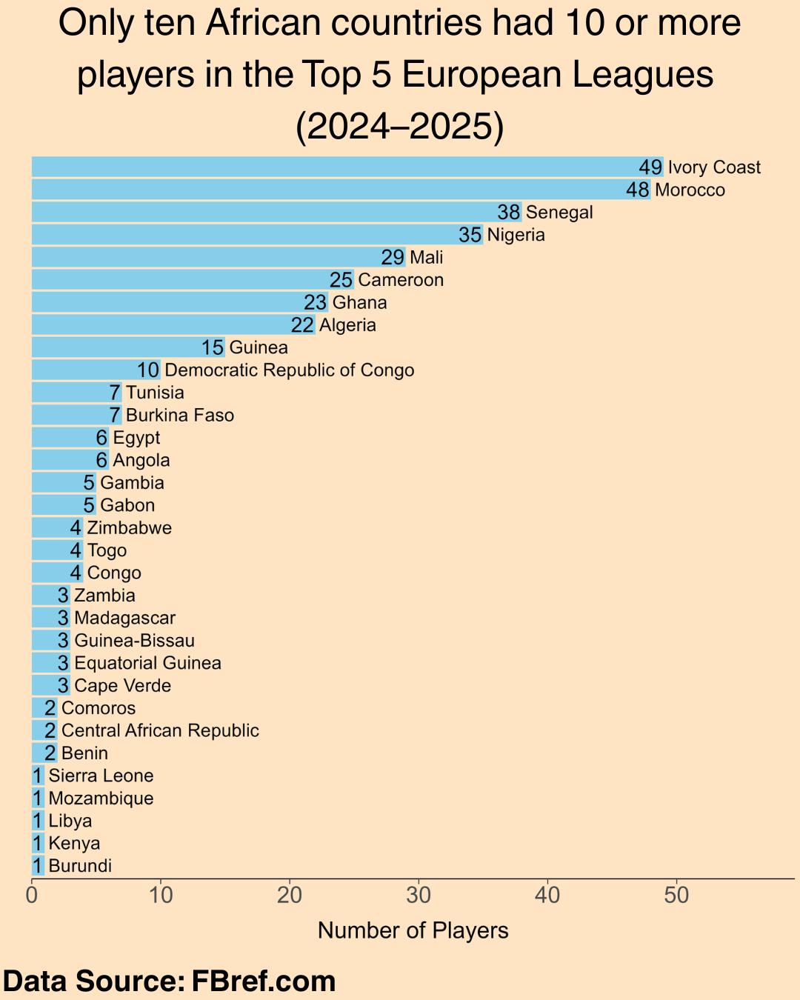
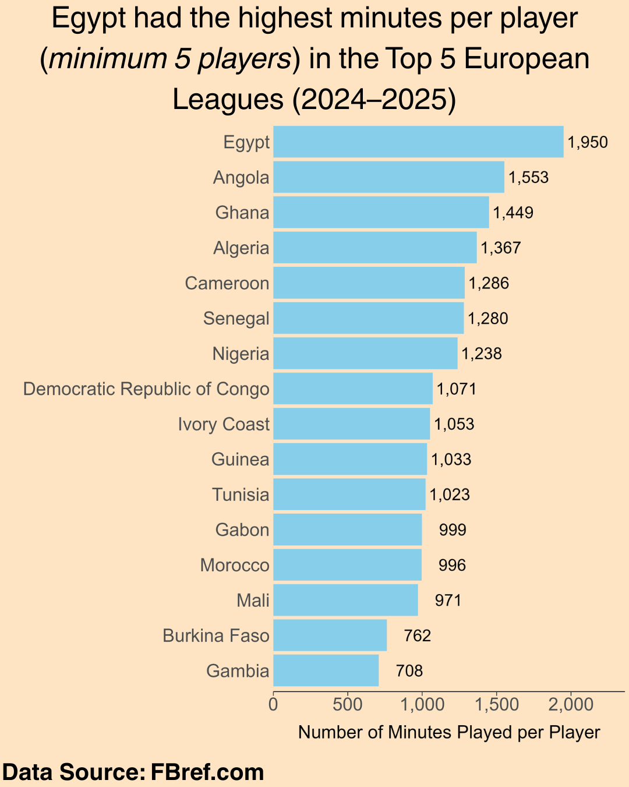
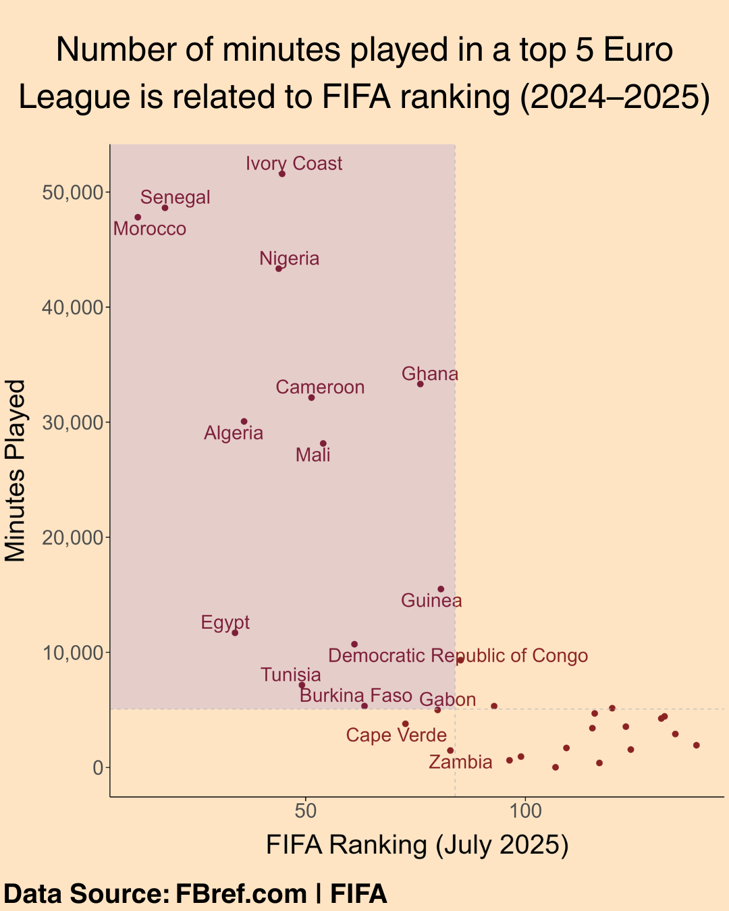
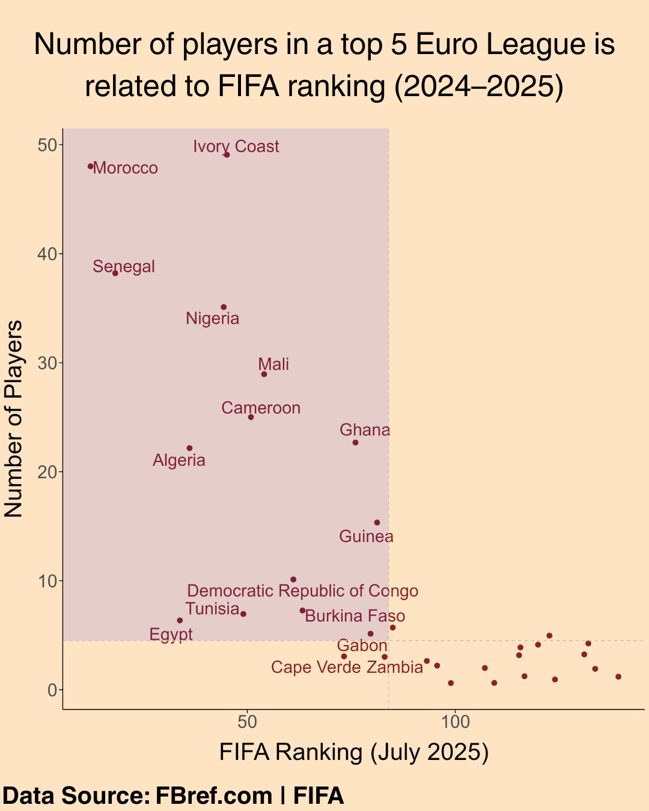
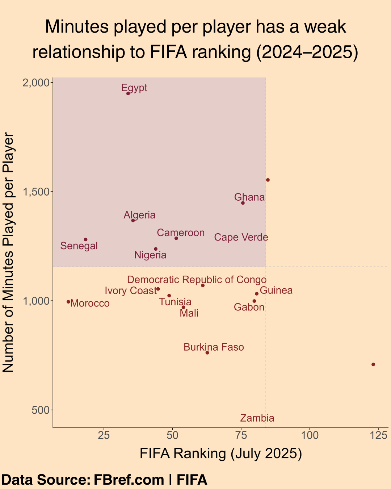
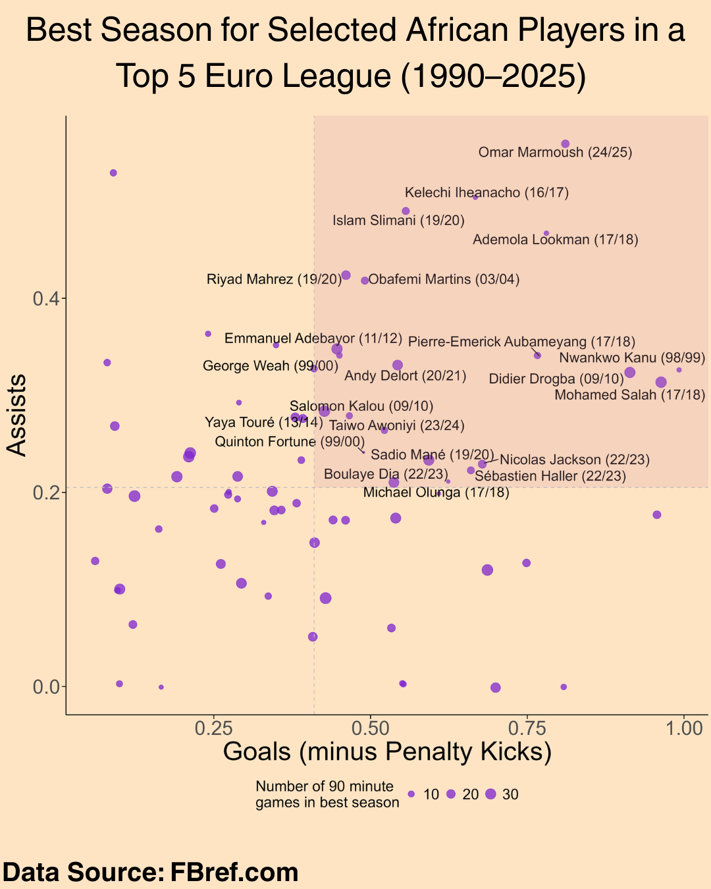

## Static (In Progress)

### A. Analysis of African Players in the top 5 European Leagues

::: {.grid}
::: {.g-col-4}
{group="my-gallery"}
:::

::: {.g-col-4}
{group="my-gallery"}
:::

::: {.g-col-4}
{group="my-gallery"}
:::

::: {.g-col-4}
{group="my-gallery"}
:::

::: {.g-col-4}
{group="my-gallery"}
:::

::: {.g-col-4}
{group="my-gallery"}
:::

::: {.g-col-4}
{group="my-gallery"}
:::
:::

## Dynamic (In Progress)

### A: African Football Legends (1990 - Present)

<iframe src="https://african-football-legends.streamlit.app/?embed=true" style="height: 450px; width: 100%;">

</iframe>

[Link to App](https://african-football-legends.streamlit.app)