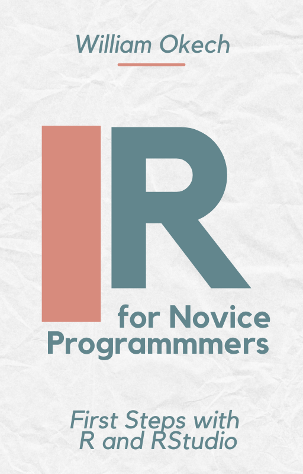

## Intro to R for Data Science

### R for Novices

**New to data analysis? No prior programming experience?**

Sign up for my free email course!

[R for Novices Email Course](https://heidiseibold.kit.com/d949a4d18c)

Also, you can review the accompanying book (*Click on cover image to access the book*).

::: {}
[{width="20%" fig-align="left"}](https://wokech.github.io/r4novice/)
:::

## Engineering Education

### Computational Thinking

::: {#posts_comp_thinking}
:::



### Minimizing Cognitive Overload

::: {#posts_min_cog_overload}
:::


